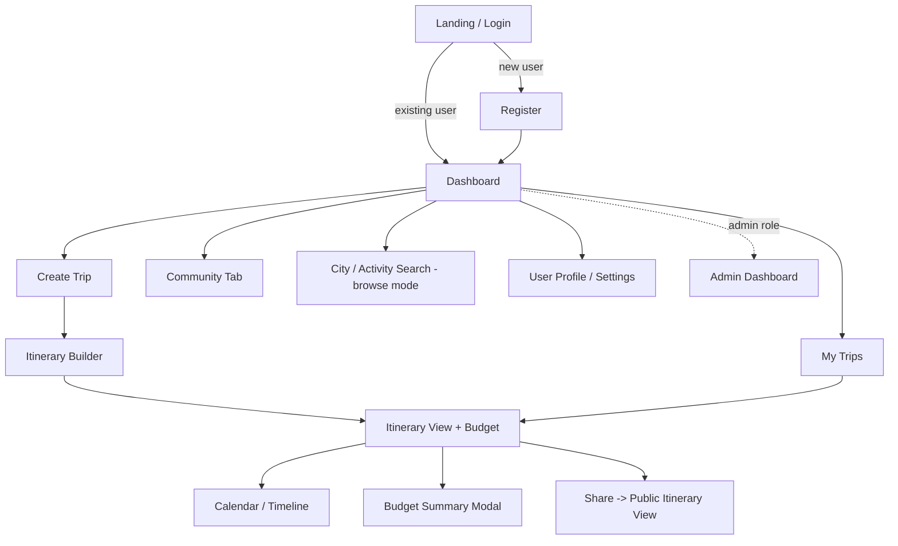
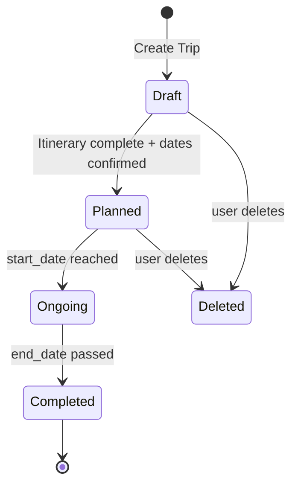
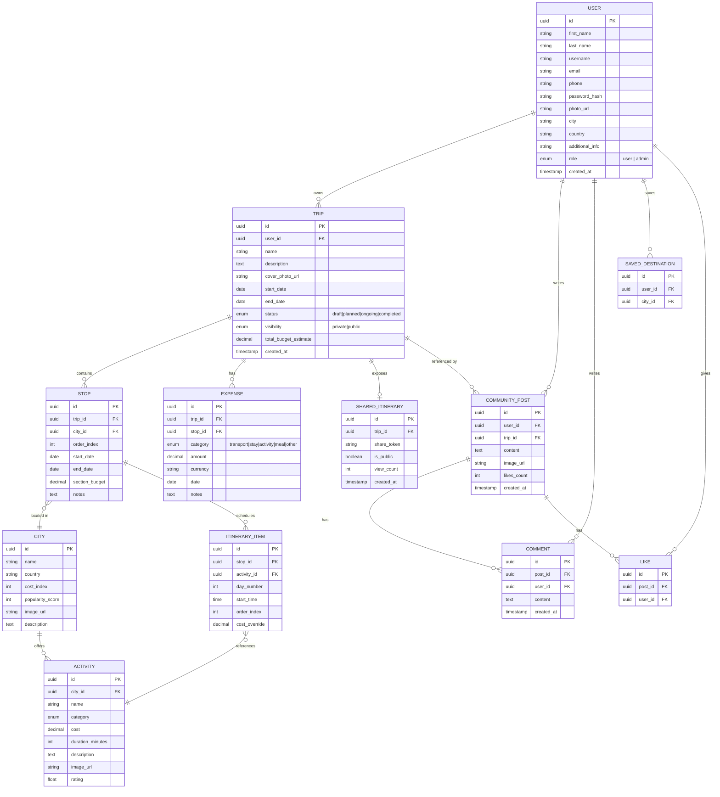
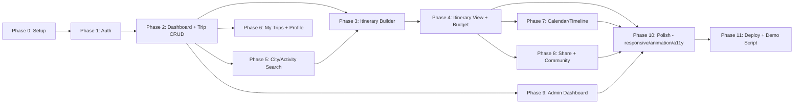

# GlobeTrotter — Master Product & Engineering Blueprint
### Odoo × LDCE Hackathon — Personalized Travel Planning Platform

> **How to use this document:** This is the single source of truth for the build. Feed it (or the relevant section) into Antigravity or ChatGPT as *context* before asking for a prompt for a specific phase or screen. Section 11 is written specifically to make that hand-off easy — each phase lists exactly what context to paste in and what to ask for. Treat this file as living; update it as decisions change during the hackathon.

---

## 0. Assumptions & Scope Note

The problem statement doesn't mandate Odoo's own framework (Python/OWL) — it asks for a robust data architecture and a smooth frontend experience. This blueprint assumes a **modern independent full-stack web app** powered by Next.js 15, NestJS, and **MongoDB (Mongoose)** for high-velocity itinerary modeling, schema flexibility, and rich document relationships.

---

## 1. Vision & Problem Restated (in one paragraph)

GlobeTrotter is a personalized, collaborative trip-planning platform: a user signs up, dreams up a multi-city trip, builds a day-by-day itinerary of cities and activities, watches a live budget total form as they add things, visualizes the plan on a calendar, and can share it publicly or browse a community feed for inspiration — all backed by a proper relational schema and available on any device.

**Hackathon judging is almost certainly weighted toward:** (1) feature completeness against the 13-point spec, (2) data model correctness/normalization, (3) UI/UX polish and responsiveness, (4) working end-to-end demo, (5) bonus admin analytics. This document is structured so nothing on that list gets missed.

---

## 2. Consolidated Feature List (PDF spec ⨯ Wireframes, reconciled)

The uploaded wireframes (12 screens) and the PDF spec (13 features) don't name things identically. Reconciled list below — **this is the canonical feature list**; build against this, not either source alone.

| # | Canonical Feature | Wireframe screen | PDF feature # | Notes |
|---|---|---|---|---|
| 1 | Login | Screen 1 | 1 | Username/password per wireframe; PDF says email — support **both** (identifier field) |
| 2 | Registration | Screen 2 | 1 | Wireframe has richer fields (phone, city, country, additional info) than PDF — use wireframe as source of truth |
| 3 | Dashboard / Home | Screen 3 | 2 | Banner, top regional selections, previous trips, "Plan a Trip" |
| 4 | Create Trip | Screen 4 | 3 | Dates + place + activity suggestions inline (wireframe merges creation with discovery) |
| 5 | Itinerary Builder | Screen 5 | 5 | Section-based (not city-based) — each section = a leg with date range + budget |
| 6 | My Trips (Trip Listing) | Screen 6 | 4 | Grouped by Ongoing / Upcoming / Completed |
| 7 | User Profile / Settings | Screen 7 | 12 | Editable details, preplanned trips, previous trips |
| 8 | City Search | *(merged into Screen 8)* | 7 | Same UI pattern as activity search, filtered to cities |
| 9 | Activity Search | Screen 8 | 8 | Search bar + group/filter/sort + result list |
| 10 | Itinerary View (with budget) | Screen 9 | 6 + 9 | Day-wise activity blocks each with an expense field — this screen **is** the budget breakdown, not a separate page |
| 11 | Community Tab | Screen 10 | *(new — not in PDF)* | Public feed of trips/posts from other users — **add this explicitly to scope** |
| 12 | Calendar / Timeline View | Screen 11 | 10 | Month grid with trip name overlays |
| 13 | Admin / Analytics Dashboard | Screen 12 | 13 (optional) | Manage Users, Popular Cities, Popular Activities, Trends tabs; charts |
| 14 | Shared / Public Itinerary View | *(not wireframed)* | 11 | **Gap — must design.** Read-only clone of Screen 9 at a public URL, plus "Copy Trip" action |
| 15 | Trip Budget & Cost Breakdown (dedicated summary) | *(implicit in Screen 9)* | 9 | Recommend a **dedicated summary panel/modal** (pie + bar charts) reachable from Screen 9, not just inline expense fields |

**Two explicit gaps to close during planning, before coding starts:**
1. **Shared/Public Itinerary View** has no wireframe — design it as a read-only variant of Screen 9 + Screen 5, stripped of edit controls, plus a "Copy Trip" CTA and social share buttons.
2. **Dedicated Budget Summary** — Screen 9 only shows per-activity expense boxes; the PDF explicitly wants pie/bar charts, per-day average, and overbudget alerts. Add a "View Budget Summary" button on Screen 9 that opens this.

---

## 3. User Personas

| Persona | Goal | Key screens |
|---|---|---|
| **Solo Planner (Priya, 27)** | Wants a quick multi-city Europe trip, keeps checking budget | Create Trip, Itinerary Builder, Budget Summary |
| **Inspiration Browser (Rohan, 24)** | Not sure where to go, browses community + top cities | Dashboard, Community Tab, City Search |
| **Group Organizer (Meera, 31)** | Shares itinerary link with friends before booking | Itinerary View, Shared Itinerary, Calendar |
| **Platform Admin** | Monitors adoption, popular destinations | Admin Dashboard |

---

## 4. Core User Flows



**Trip lifecycle (state machine):**



Drive the **Ongoing / Upcoming / Completed** grouping on Screen 6 directly off this `status` field rather than recomputing from dates on every render — compute status server-side (cron or on-read check) and store it.

---

## 5. Relational Data Model



**Design notes:**
- `STOP` = the "Section" in the wireframe's Itinerary Builder — one row per leg of the trip, each tied to a city, its own date range, and its own budget (`section_budget` maps directly to "Budget of this section").
- `ITINERARY_ITEM` is what feeds the Day 1 / Day 2 activity blocks on the Itinerary View screen; `cost_override` lets a user edit an activity's default cost for their trip without mutating the shared `ACTIVITY` catalog row.
- `EXPENSE` is separate from `ITINERARY_ITEM` cost so the Budget Summary can include non-activity costs (flights, hotel, misc) that the PDF's cost-breakdown screen calls for.
- Keep `ACTIVITY` and `CITY` as shared catalog tables (admin-managed / seeded), not per-user — this is what the Admin Dashboard's "Popular Cities" / "Popular Activities" tabs aggregate over.
- `SHARED_ITINERARY.share_token` is a random opaque slug (not the trip's real id) for the public URL, satisfying the PDF's "Public URL" requirement without leaking internal ids.

---

## 6. Screen-by-Screen Functional Spec

For each screen: purpose, components, states, and the API calls it makes. Use this table verbatim as "context" when asking Antigravity/ChatGPT to scaffold a screen.

### Screen 1 — Login
- **Components:** avatar/logo, identifier field (email or username), password field, login button, "forgot password" link, "create account" link.
- **States:** idle, submitting, error (invalid credentials), locked-out (optional rate limit).
- **API:** `POST /auth/login` → `{ token, refreshToken, user }`.
- **Validation:** required fields, basic email/username format check client-side; server re-validates.

### Screen 2 — Registration
- **Components:** photo upload (circular preview), first name, last name, email, phone, city, country, "additional information" textarea, register button.
- **States:** idle, uploading photo, submitting, field-level errors, success → redirect to Dashboard.
- **API:** `POST /auth/register`, `POST /uploads/avatar` (pre-signed URL flow recommended).

### Screen 3 — Dashboard / Home
- **Components:** header w/ profile avatar, banner image (rotating/hero), search bar + Group by/Filter/Sort controls, "Top Regional Selections" (5 city cards, clickable → City detail/search), "Previous Trips" (3-card preview → My Trips), floating "+ Plan a Trip" button.
- **API:** `GET /cities/top`, `GET /trips?limit=3&sort=recent`, `GET /users/me`.
- **Empty state:** first-time user sees onboarding prompt instead of "Previous Trips."

### Screen 4 — Create Trip
- **Components:** Start Date, "Select a Place" (autocomplete → City Search), End Date fields; "Suggestions for Places to Visit / Activities to Perform" grid (6 cards, pulled from selected city's top activities).
- **Behavior:** selecting a place dynamically loads suggestion cards below; saving creates a `TRIP` (status=draft) + first `STOP`.
- **API:** `POST /trips`, `GET /cities/search?q=`, `GET /cities/:id/activities?top=6`.

### Screen 5 — Build Itinerary (section-based)
- **Components:** repeatable "Section" cards, each with a free-text description area, Date Range picker, Budget input; "+ Add another Section" button at bottom.
- **Behavior:** each Section = one `STOP`. Reordering sections should be drag-and-drop (animate with Framer Motion's `Reorder` component).
- **API:** `POST /trips/:id/stops`, `PATCH /stops/:id`, `DELETE /stops/:id`, `PATCH /trips/:id/stops/reorder`.

### Screen 6 — My Trips (Trip Listing)
- **Components:** search/group/filter/sort bar, three collapsible sections — Ongoing, Up-coming, Completed — each rendering trip summary cards; floating "+" to create a new trip.
- **API:** `GET /trips?status=ongoing`, `...?status=upcoming`, `...?status=completed` (or one call, grouped client-side).

### Screen 7 — User Profile
- **Components:** avatar + editable user-details panel, "Preplanned Trips" row (3 cards, "View" buttons), "Previous Trips" row (3 cards, "View" buttons).
- **API:** `GET /users/me`, `PATCH /users/me`, `GET /trips?status=planned|completed`.

### Screen 8 — City Search / Activity Search
- **Components:** single search input (context-dependent placeholder, e.g. "Paragliding"), Group by / Filter / Sort controls, vertical result list ("Option and its details" cards — image, name, cost, rating, "Add to Trip").
- **Behavior:** same component reused for both City Search and Activity Search — toggle a `mode` prop/query param.
- **API:** `GET /cities?query=&country=&sort=`, `GET /activities?query=&category=&cost_max=&sort=`.

### Screen 9 — Itinerary View + Budget
- **Components:** per-stop header, Day N groupings, each day a vertical stack of activity blocks with a connecting arrow (sequence) and a paired expense box; "View Budget Summary" button.
- **Budget Summary (modal or sub-route):** pie chart (cost by category), bar chart (cost by day), total vs. budgeted, overbudget day warnings.
- **API:** `GET /trips/:id/itinerary`, `GET /trips/:id/budget-summary`, `PATCH /itinerary-items/:id`.

### Screen 10 — Community Tab
- **Components:** feed of posts — avatar, content card (trip snippet/photo/text), like/comment affordances.
- **API:** `GET /community/feed`, `POST /community/posts`, `POST /posts/:id/like`, `POST /posts/:id/comments`.
- **Note:** this screen isn't in the PDF spec — treat it as a bonus/differentiator feature; keep MVP simple (read + like), defer comments if time-constrained.

### Screen 11 — Calendar / Timeline
- **Components:** month grid, prev/next navigation, trips rendered as labeled bars/chips on their date ranges (supports multi-day span across cells).
- **API:** `GET /trips?month=&year=` (return start/end so the client can render spans).
- **Interaction:** clicking a trip chip deep-links to its Itinerary View.

### Screen 12 — Shared / Public Itinerary View *(new — design per Section 2 gap)*
- **Components:** read-only version of Screen 9's day-wise layout + trip header (name, dates, cover photo), "Copy this Trip" button, social share icons.
- **API:** `GET /public/itineraries/:share_token]` (no auth required), `POST /trips/:id/copy` (auth required, triggered post-login if anonymous).

### Screen 13 — Admin / Analytics Dashboard
- **Components:** tab bar (Manage Users / Popular Cities / Popular Activities / User Trends & Analytics), summary card with pie chart (category split), line chart (growth trend), bar chart (top items) + ranked list.
- **API:** `GET /admin/users`, `GET /admin/analytics/cities`, `GET /admin/analytics/activities`, `GET /admin/analytics/trends`.
- **Access control:** route + API both gated on `role = admin`.

---

## 7. Non-Functional Requirements

| Category | Requirement |
|---|---|
| **Responsiveness** | Every screen must work at 3 breakpoints minimum: mobile (≤480px), tablet (481–1024px), desktop (>1024px). Use fluid/container-query layout, not just breakpoint stacking — card grids (Top Regional Selections, Trip cards, Activity results) should reflow from 1 → 2 → 4+ columns. |
| **Performance** | Route-level code splitting; images via `next/image` with responsive `srcset`; paginate/virtualize long lists (Activity Search results, Community feed). |
| **Accessibility** | WCAG 2.1 AA: semantic landmarks, focus states, form labels, color contrast ≥4.5:1, `prefers-reduced-motion` respected for all animation. |
| **Security** | Hash passwords (bcrypt/argon2), JWT + refresh-token rotation, RBAC middleware for admin routes, rate-limit auth endpoints, sanitize community post content (XSS). |
| **Data integrity** | Foreign-key constraints per the ER diagram; cascading deletes scoped carefully (deleting a Trip should cascade to Stops/ItineraryItems/Expenses but never to the shared Activity/City catalog). |
| **Offline/error handling** | Optimistic UI for itinerary edits with rollback on failure; toast-based error surfacing; skeleton loaders, not blank screens. |

---

## 8. Recommended Tech Stack (modern, animation-capable, fully responsive)

| Layer | Choice | Why |
|---|---|---|
| **Framework** | Next.js 15 (App Router) + React 19 + TypeScript | SSR/streaming for fast first paint on the Dashboard/Search screens, file-based routing maps cleanly to the 13 screens, React Server Components cut client JS. |
| **Styling** | Tailwind CSS v4 + `shadcn/ui` (Radix primitives) | Utility-first for rapid responsive layout; shadcn gives accessible, themeable base components (dialogs, calendars, forms) you customize rather than build from scratch. |
| **Animation** | Framer Motion (`motion/react`) for micro-interactions, shared-layout transitions, and drag-to-reorder (Itinerary Builder sections, Itinerary day-blocks); GSAP + ScrollTrigger for the Dashboard hero/banner; Lottie (`lottie-react`) for empty-state/success illustrations | Framer Motion's `layoutId` gives cheap, high-polish card→detail transitions (e.g., City card → City Search result); respects `prefers-reduced-motion` out of the box. |
| **Forms & validation** | React Hook Form + Zod | Type-safe schemas shared between client validation and API request typing. |
| **Client/server state** | TanStack Query (server cache) + Zustand (small UI/global state, e.g. active trip draft) | Avoids prop-drilling across the multi-step Create Trip → Itinerary Builder flow. |
| **Charts** | Tremor or Recharts (Budget Summary, Admin Dashboard) | Both are React-native, thestreamlined for dashboard-style pie/bar/line combos the spec explicitly asks for. |
| **Calendar** | `react-day-picker` (date range pickers in Create Trip/Sections) + a custom month-grid component or FullCalendar for Screen 11 | FullCalendar handles multi-day event spans out of the box, which the Calendar View needs. |
| **Maps (optional polish)** | Mapbox GL JS or Leaflet + `react-leaflet` | Nice-to-have pin map on City Search results; skip if time-constrained. |
| **Backend** | Node.js + NestJS (TypeScript) | Modular architecture (modules/controllers/services) demos well and maps 1:1 to the resource list in Section 6 — good for judges evaluating architecture, not just UI. |
| **Database / ODM** | MongoDB + Mongoose | MongoDB document model provides clean subdocument nesting for Stops and ItineraryItems, high-speed indexed lookups, and flexible document schema. |
| **Auth** | JWT (access + refresh) via NestJS Passport strategy, or Auth.js/Clerk if you want to cut auth build time to near-zero | Clerk/Auth.js recommended if the team is small and time-boxed; roll your own JWT if a judge specifically wants to see custom auth logic. |
| **File storage** | Cloudinary (image transforms built-in — handy for avatar/cover-photo circles and responsive banner images) | |
| **Search** | MongoDB text indexes & regex search for City/Activity discovery | Fast, native, and zero additional infrastructure. |
| **Testing** | Vitest + React Testing Library (unit), Playwright (e2e smoke test of the core flow: register → create trip → build itinerary → view budget) | One good Playwright script covering the golden path is worth more to a demo than broad unit coverage. |
| **Monorepo** | Turborepo — `apps/web`, `apps/api`, `packages/ui`, `packages/config` | Keeps design tokens and types shared between frontend and backend. |
| **Hosting/CI** | Vercel (web) + Render/Railway (API + MongoDB Atlas) + GitHub Actions for lint/test on PR | Fast, judge-shareable public URLs for both the app and the shared/public itinerary links. |

**If Odoo's own framework is actually required:** swap the frontend to Odoo's OWL (Owl Web Library) components + QWeb templates, backend to Odoo's Python ORM models (`models.Model` classes mirroring Section 5's entities). The ER diagram, feature list, and phase plan below all remain valid — only the implementation layer changes.

---

## 9. Design System Quick Reference

- **Typography:** one display font for headings (e.g. a rounded/geometric sans like "Sora" or "Cabinet Grotesk") + one workhorse body font ("Inter" or "Geist"). Fluid sizing via `clamp()`.
- **Color:** a single accent hue driving buttons/links/active states (avoid defaulting to generic Tailwind indigo — pick something travel-appropriate: warm terracotta, deep teal, or sunset gradient) + neutral gray scale + semantic colors (success/warn/error) for budget-alert states.
- **Spacing/radius:** consistent 4/8px spacing scale; generous corner radius (12–16px) on cards to match the rounded wireframe aesthetic already in the mockups.
- **Motion tokens:** define once — `duration-fast` (120ms, hover states), `duration-base` (240ms, card transitions), `duration-slow` (480ms, page/route transitions), one consistent easing curve (e.g. `cubic-bezier(0.16, 1, 0.3, 1)`), applied globally so nothing feels inconsistent.
- **Dark mode:** the wireframes are already dark-themed — ship dark mode as default, light mode as a toggle in Profile/Settings.

---

## 10. Development Methodology — Context / Loop / Graph Engineering

Since this document is meant to feed an AI pair-programmer (Antigravity/ChatGPT) phase-by-phase, build with these three disciplines deliberately:

### 10.1 Context Engineering
Don't paste this whole file into every prompt — that dilutes the model's attention. For each phase/screen, assemble a **minimal sufficient context pack**:
1. The relevant row(s) from Section 6 (screen spec).
2. The relevant slice of the ER diagram (Section 5) — only the tables that screen touches.
3. The design tokens from Section 9.
4. Any already-generated code the new work must be consistent with (e.g., paste the existing `Button`/`Card` component before asking for a new screen that uses them).
5. One explicit non-goal (e.g., "do not implement the Community tab in this prompt — that's a later phase") to stop scope creep in the generated output.

### 10.2 Loop Engineering
Treat each phase as a **generate → run → critique → refine** loop, not a single-shot prompt:
1. **Plan prompt** — ask the AI to restate the plan for the phase before writing code (catches misunderstanding early, cheaply).
2. **Generate prompt** — ask for the implementation against the context pack above.
3. **Test loop** — run it locally/in Antigravity's sandbox immediately; feed errors back verbatim rather than re-describing them.
4. **Critique pass** — explicitly ask "review this against [responsiveness / accessibility / the ER diagram] and fix gaps" as a separate turn; a dedicated review prompt catches things a single generate-prompt misses.
5. **Regression check** — before moving to the next phase, re-run the Playwright golden-path script so loops don't silently break earlier phases.

### 10.3 Graph Engineering
Use the graphs already in this document as planning tools, not just documentation:
- **Phase dependency graph (below)** decides build *order* — don't let the team start Screen 11 (Calendar) before Screen 5/9 (Itinerary) exist, since Calendar reads trip date ranges that originate there.
- **Trip state machine (Section 4)** should be implemented as an actual guarded state transition function/service, not scattered `if` statements — one place that owns "what can `status` become next."
- **ER graph (Section 5)** is the contract between frontend and backend — any schema change should be a graph edit first, migration second, UI change third.
- **Navigation graph (Section 4)** doubles as your router config — each node is a route, each edge a link/redirect the QA pass must click through.



---

## 11. Phased Roadmap — Context Packs Per Phase

Each phase below is written so you can copy its block directly into Antigravity/ChatGPT as the *context*, then ask "give me a prompt to build this phase" or "implement this phase."

### Phase 0 — Foundations
- **Goal:** repo scaffold, design tokens, MongoDB Mongoose schemas connected, empty route shells for all 13 screens, auth middleware stub.
- **Deliverables:** Turborepo monorepo, NestJS API with Mongoose connection, Next.js 15 frontend, shared UI package with Atlas & Ink design tokens.
- **Done when:** MongoDB connection is verified; every route in the nav graph renders cleanly.

### Phase 1 — Auth (Screens 1–2)
- **Context to paste:** Screen 1 & 2 rows from Section 6, `USER` entity from Section 5.
- **Done when:** register → login → redirected to Dashboard with a real JWT session; validation errors shown inline.

### Phase 2 — Dashboard & Trip Creation (Screens 3–4)
- **Context to paste:** Screen 3 & 4 rows, `TRIP`/`CITY`/`STOP` entities.
- **Done when:** a logged-in user can hit "Plan a Trip," fill Create Trip, and land on an (empty) Itinerary Builder for a real `TRIP` row.

### Phase 3 — Itinerary Builder (Screen 5)
- **Context to paste:** Screen 5 row, `STOP` entity, note on drag-reorder using Framer Motion `Reorder`.
- **Done when:** sections can be added/reordered/deleted and persist as `STOP` rows with date range + budget.

### Phase 4 — Itinerary View + Budget (Screen 9 + dedicated Budget Summary)
- **Context to paste:** Screen 9 row, `ITINERARY_ITEM`/`EXPENSE` entities, chart library choice from Section 8.
- **Done when:** activities render grouped by day with running cost per day; Budget Summary modal shows pie/bar breakdown and flags overbudget days.

### Phase 5 — City & Activity Search (Screen 8)
- **Context to paste:** Screen 8 row, `CITY`/`ACTIVITY` entities.
- **Done when:** search + group/filter/sort works against seeded city/activity data; "Add to Trip" writes an `ITINERARY_ITEM`/`STOP`.

### Phase 6 — My Trips & Profile (Screens 6–7)
- **Context to paste:** Screen 6 & 7 rows, trip state machine (Section 4).
- **Done when:** trips correctly bucket into Ongoing/Upcoming/Completed off `status`; profile edits persist.

### Phase 7 — Calendar / Timeline (Screen 11)
- **Context to paste:** Screen 11 row, note that trip chips must span multiple day-cells.
- **Done when:** month view renders all of a user's trips as spanning chips, clickable to their Itinerary View.

### Phase 8 — Sharing & Community (Screens 10, 12)
- **Context to paste:** Screen 10 & 12 rows, `SHARED_ITINERARY`/`COMMUNITY_POST` entities.
- **Done when:** a trip can be made public and viewed at its share URL without auth; feed shows posts with like counts.

### Phase 9 — Admin Dashboard (Screen 13)
- **Context to paste:** Screen 13 row, admin RBAC note from Section 7.
- **Done when:** admin-only route shows real aggregate charts (top cities/activities, user growth) computed from seeded/demo data.

### Phase 10 — Responsive & Animation Polish
- **Context to paste:** Section 7 (responsiveness table), Section 9 (motion tokens).
- **Done when:** every screen checked at 3 breakpoints; route transitions, card hovers, and drag interactions all animated per the motion tokens; `prefers-reduced-motion` verified.

### Phase 11 — Deploy & Demo Script
- **Goal:** deployed public URL, seeded demo data (a few realistic trips/cities/activities), a rehearsed 3–5 minute click-through hitting every one of the 13 screens in the graph order from Section 10.3.

---

## 12. Suggested API Surface (REST)

```
POST   /auth/register
POST   /auth/login
POST   /auth/refresh

GET    /users/me
PATCH  /users/me

GET    /trips?status=&sort=&limit=
POST   /trips
GET    /trips/:id
PATCH  /trips/:id
DELETE /trips/:id
POST   /trips/:id/copy

POST   /trips/:id/stops
PATCH  /stops/:id
DELETE /stops/:id
PATCH  /trips/:id/stops/reorder

GET    /trips/:id/itinerary
PATCH  /itinerary-items/:id
POST   /itinerary-items

GET    /trips/:id/budget-summary
POST   /trips/:id/expenses

GET    /cities?query=&country=&sort=
GET    /cities/top
GET    /cities/:id/activities

GET    /activities?query=&category=&cost_max=&sort=

GET    /community/feed
POST   /community/posts
POST   /posts/:id/like
POST   /posts/:id/comments

GET    /public/itineraries/:share_token
POST   /trips/:id/share

GET    /admin/users
GET    /admin/analytics/cities
GET    /admin/analytics/activities
GET    /admin/analytics/trends
```

---

## 13. Folder Structure (Turborepo)

```
globetrotter/
├── apps/
│   ├── web/                 # Next.js 15 app router frontend
│   │   ├── app/
│   │   │   ├── (auth)/login/
│   │   │   ├── (auth)/register/
│   │   │   ├── (app)/dashboard/
│   │   │   ├── (app)/trips/create/
│   │   │   ├── (app)/trips/[id]/itinerary/
│   │   │   ├── (app)/trips/[id]/budget/
│   │   │   ├── (app)/trips/mine/
│   │   │   ├── (app)/profile/
│   │   │   ├── (app)/search/
│   │   │   ├── (app)/community/
│   │   │   ├── (app)/calendar/
│   │   │   ├── (public)/share/[token]/
│   │   │   └── (admin)/admin/
│   │   └── components/
│   └── api/                 # NestJS backend
│       ├── src/auth/
│       ├── src/trips/
│       ├── src/stops/
│       ├── src/itinerary/
│       ├── src/cities/
│       ├── src/activities/
│       ├── src/community/
│       ├── src/admin/
│       └── schemas/*.schema.ts
├── packages/
│   ├── ui/                  # shared shadcn-based component library
│   └── config/              # shared eslint/tsconfig/tailwind config
└── turbo.json
```

---

## 14. Risks & Mitigations

| Risk | Mitigation |
|---|---|
| Time runs out before Admin Dashboard (marked "optional" in PDF) | Build it last (Phase 9); everything else in the roadmap doesn't depend on it. |
| Community tab scope creep (it's not in the PDF at all) | Cap MVP to read-feed + like; cut comments if behind schedule. |
| Drag-and-drop reordering eats time | Ship static ordering first (up/down arrow buttons), upgrade to drag only if time allows — the graph dependency doesn't require drag specifically. |
| Seeding realistic city/activity data | Pre-write a JSON seed file (20–30 cities, 5–10 activities each) as part of Phase 0, not left until demo prep. |
| Judges testing on mobile | Do a dedicated mobile pass after every phase, not only in Phase 10 — cheaper to catch early. |

---

## 15. Next Step

Pick a phase from Section 11, paste its **context pack** into Antigravity or ChatGPT, and ask for either (a) a restated plan, or (b) a full implementation prompt. Work the loop in Section 10.2 for each phase before moving to the next node in the Section 10.3 dependency graph.
